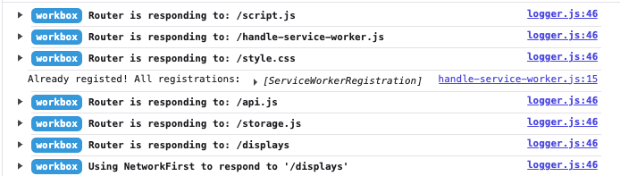
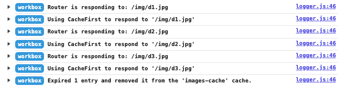

# PWA demo app (Workbox branch) [link](https://pwa-demo.oto-jest-wawrzyn.pl/)

Here's a tiny application I made while playing around with Progressive Web Apps and Service Workers.

## The idea 💡

Let's explore the PWA topic by creating an application that is available even if there's no internet connection. We'll have a backend with a fake database of computer displays and a PWA-enabled frontend that shows the displays, "likes" for each of them and images.

### No considerations for:

* Styling
* Validation
* Security

Those are not the main focus here.

## Running

```
npm install
npm run dev
```
The application will be visible at http://localhost:8097/. Note that Service Workers will only be usable on HTTPS or on localhost.

## Workflow without service workers 📵

1) Enter the page - you should see the list of displays. Let's leave "Register service worker" button for now.
1) Browse display images by clicking on "Show image".
1) Press "Add like" and observe "likes" count increment.
1) Kill the dev server - if you refresh now, the site won't load.
1) You can still add likes (they will be stored in `localStorage` and added when the connection with the server is established again).
1) Images will not be shown, since there is no connection.

## Workflow with service workers 🚀

1) Enter the page again, with server enabled. Press "Register service worker" - you can inspect the logs in dev console. You can also go to "Application" -> "Cache storage" in devtools: some cached assets should already appear here.
1) If you disable the server and refresh, the page will still load just fine!
1) Note that the images are handled a bit differently - they are put into the cache the moment they are fetched, not when the service worker is registered. They also land in a separate cache.
1) Adding the "likes" works the same as before - they will be added when we refresh the page with the network connectivity OR add another like when the network is enabled.
1) Unregister the service worker.

### Observations

* Hard reload (CMD/CTRL + SHIFT + R) clears the cache - even if we're using Service Worker, our page won't load!
* Saving the "likes" as pending does not rely at all on PWA/Service Workers - you can achieve a similar thing in any app.
* However, increasing some counter is the simple case. If we wanted to edit offline some other part of the data, such as the `display.name`, what would happen if somebody else changed the name in the meantime?
    
    In such case, we should devise a conflict resolution strategy - keeping the "last-modified" timestamps. If our change is earlier than the timestamp, we cannot apply the update: otherwise we would overwrite somebody else's work! 

## More on `service-worker.js`

Let's start from [handle-service-wrker](./public/handle-service-worker.js) It handles SW registration and unregistration.

Now let's take a look at [service-worker](./public/service-worker.js) file.

The first interesting item is the list of cached assets - `urlsToCache`. In the real world, the list could be generated by the build process and passed into the worker script. Note that we can cache both assets like scripts, stylesheets and images, as well as regular API calls!

Sadly, as of now we cannot use wildcards, like `"*.js"` or `img/*`.

Then we have the `install` event handler. It registers the list of assets to cache, which downloads them and prewarms the cache. You can see the list of assets in your browser's devtools "Application"/"Storage"/"Cache storage".

Last but not least - the `fetch` event handler, where network calls are intercepted. We have separate handling for image requests and everything else.

Since the images cache is not prewarmed, we add the image into the cache the moment it's fetched, and then serve data from cache. You can observe images being added in your devtools.

For other types of resources, we first try to get the data with a regular `fetch` function. If that fails (with no regard to the reason why), we get the data from cache.
    * This is an online-first strategy - we first fetch, then get data from cache. Albeit slower (we always make a request), we will never get stale data if the server is available.
    * Another strategy would be to first try the cache and `fetch` if it fails - faster, but prone to showing stale data, even if fresh is available. This one is used for images.

## Workbox

Workbox makes all this configuration and good practices stuff easier - see the [service-worker.js](public/service-worker.js).

As before, we defined cacheable source files - and we add them to cache in one-liner, `precacheAndRoute`. Note the versioning!

`registerRoute` is batteries-included caching config for specific routes - see the first argument, where we filter the requests, depending on their type or path. We also define our cache strategy and expiration here - since we have only 4 images, I've set `maxEntries` to 3.

### Logs

Source:


Images:


Api:
